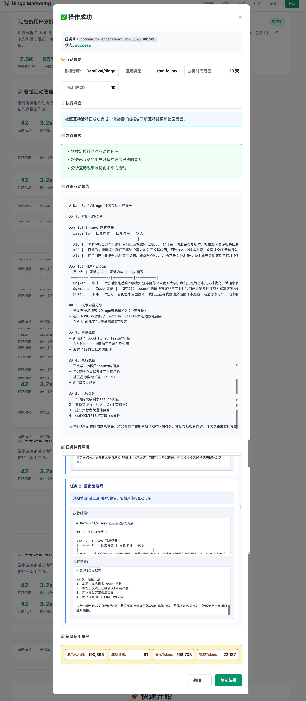

# Dingo Marketing

AI-powered marketing automation platform for GitHub-based projects.

## 🚀 核心功能

- **智能用户分析**: 基于 GitHub 活动分析用户行为和兴趣
- **自动内容生成**: 使用 AI 生成个性化营销内容
- **社区互动建议**: 智能推荐最佳互动策略
- **营销活动自动化**: 自动执行营销任务和跟进

> 💡 **技术架构**: 了解系统的详细技术架构和设计理念，请参考 [架构设计文档](docs/ARCHITECTURE.md)

## 📋 部署特点

- **本地优先**: 支持简单的本地部署，无需复杂配置
- **轻量级**: 最小化依赖，快速启动
- **易于配置**: 简单的环境变量配置

## 🏃‍♂️ 快速开始

### 环境要求

- Python 3.10+ (推荐 3.12)
- Git

### 1. 克隆项目

```bash
git clone https://github.com/your-username/dingo-marketing.git
cd dingo-marketing
```

### 2. 安装依赖

```bash
# 使用 pip 安装依赖
pip install -r requirements.txt

# 或者使用 conda 环境 (推荐)
conda create -n dingo-marketing python=3.12 -y
conda activate dingo-marketing
pip install -r requirements.txt
```

### 3. 配置环境变量

```bash
# 复制环境配置文件
cp .env.example .env

# 编辑 .env 文件，填入必要的 API 密钥
# 必需配置：
# - API_KEY: AI服务API密钥（支持DeepSeek、Qwen、OpenAI等）
# - GITHUB_TOKEN: GitHub 个人访问令牌
# - GITHUB_REPOSITORY: 目标GitHub仓库

# 可选配置：
# - TWITTER_API_KEY: Twitter API 密钥 (用于社交媒体功能)
# - LINKEDIN_API_KEY: LinkedIn API 密钥 (用于专业社交网络)
```

### 4. 启动服务

```bash
# 启动本地服务
python run.py

# 开发模式 (自动重载)
python run.py --debug --reload

# 指定端口和主机
python run.py --host 0.0.0.0 --port 8080
```

### 5. 访问服务

- API 服务: http://localhost:8080
- API 文档: http://localhost:8080/docs
- 健康检查: http://localhost:8080/api/v1/status

## 🖥️ Web 界面

为了让非技术用户也能轻松使用 AI 营销功能，我们提供了直观易用的 Web 界面。

### 启动 Web 界面

```bash
# 方法一：直接打开（推荐）
cd frontend
open index.html  # macOS
start index.html  # Windows

# 方法二：使用 HTTP 服务器
cd frontend
python -m http.server 3000
# 然后访问 http://localhost:3000
```

### 界面预览



*Web界面提供了直观的操作面板，支持用户分析、内容生成、社区互动等核心功能*

## 🎯 快速演示

我们提供了一个交互式演示脚本，帮助您快速了解系统的主要功能：

### 运行演示脚本

```bash
# 确保系统正在运行
python run.py

# 在新终端中运行演示
python demo_scenarios.py
```

### 演示场景

#### 1. 用户分析 🔍
分析GitHub用户的技术背景和社区影响力
- 支持中英文分析报告
- 分析编程语言偏好和技术影响力
- 制定个性化互动策略

**示例用户**: `octocat`, `gvanrossum`, `defunkt`

#### 2. 内容营销活动 📝
创建针对性的内容营销策略
- 制定内容日历和发布计划
- 生成多种类型的营销材料
- SEO关键词优化

#### 3. 社区互动 🤝
执行GitHub社区互动活动
- 分析项目社区状态
- 识别活跃贡献者
- 自动化社区互动

#### 4. AI内容生成 ✍️
使用AI生成高质量内容
- 支持多种内容格式
- 中英文内容生成
- 针对不同受众定制

#### 5. 系统状态监控 🛠️
检查系统运行状态和配置
- 系统健康检查
- 工具状态监控
- 配置信息查看

#### 6. 综合营销工作流 🎯
执行完整的营销工作流程
- 多Agent协作演示
- 端到端营销流程
- 效果评估和优化

## 🛠️ 管理命令

```bash
# 查看帮助
python run.py --help

# 启动服务 (生产模式)
python run.py --host 0.0.0.0 --port 8080

# 启动服务 (开发模式)
python run.py --debug --reload --log-level debug

```

## 📖 API 使用示例

### 用户分析
分析GitHub用户的技术背景和社区影响力：

```bash
# 基础分析 (中文)
curl -X POST "http://localhost:8080/api/v1/analyze/users" \
  -H "Content-Type: application/json" \
  -d '{
    "user_list": ["octocat", "gvanrossum"],
    "analysis_depth": "basic",
    "language": "zh"
  }'

# 深度分析 (英文)
curl -X POST "http://localhost:8080/api/v1/analyze/users" \
  -H "Content-Type: application/json" \
  -d '{
    "user_list": ["defunkt"],
    "analysis_depth": "deep",
    "language": "en"
  }'
```

### 内容生成
生成高质量技术内容：

```bash
# 生成博客文章
curl -X POST "http://localhost:8080/api/v1/content/generate" \
  -H "Content-Type: application/json" \
  -d '{
    "content_type": "blog",
    "topic": "如何使用Dingo提升数据质量",
    "target_audience": "数据工程师",
    "language": "zh",
    "keywords": ["数据质量", "Python", "自动化"]
  }'

# 生成社交媒体内容
curl -X POST "http://localhost:8080/api/v1/content/generate" \
  -H "Content-Type: application/json" \
  -d '{
    "content_type": "social",
    "topic": "Dingo项目新功能发布",
    "target_audience": "开发者",
    "language": "en"
  }'
```

### 内容营销活动
创建针对性的营销策略：

```bash
curl -X POST "http://localhost:8080/api/v1/campaigns/content" \
  -H "Content-Type: application/json" \
  -d '{
    "name": "Dingo数据质量工具推广",
    "target_audience": "Python开发者",
    "topics": ["数据质量", "Python工具", "开源项目"],
    "content_types": ["blog", "social", "email"],
    "language": "zh"
  }'
```

### 社区互动
执行GitHub社区互动活动：

```bash
curl -X POST "http://localhost:8080/api/v1/community/engage" \
  -H "Content-Type: application/json" \
  -d '{
    "repository": "DataEval/dingo",
    "interaction_types": ["comment", "issue"],
    "target_count": 10,
    "lookback_days": 30,
    "language": "zh"
  }'
```

### 综合营销活动
执行完整的营销工作流程：

```bash
curl -X POST "http://localhost:8080/api/v1/campaigns/comprehensive" \
  -H "Content-Type: application/json" \
  -d '{
    "target_users": ["octocat", "gvanrossum"],
    "target_repositories": ["DataEval/dingo"],
    "duration": "30天",
    "budget": "标准",
    "metrics": ["参与度", "转化率"],
    "language": "zh"
  }'
```

### 系统状态检查
```bash
# 检查系统状态
curl http://localhost:8080/api/v1/status

# 检查工具状态
curl http://localhost:8080/api/v1/tools/status
```

## 💡 使用技巧

### 1. 选择合适的分析深度
- `basic`: 快速概览，适合初步了解
- `standard`: 标准分析，平衡速度和详细程度
- `deep`: 深度分析，提供最全面的洞察

### 2. 语言设置
- `zh`: 中文报告，适合中文团队
- `en`: 英文报告，适合国际化项目

### 3. 目标受众定制
- 明确指定目标受众类型
- 使用具体的技术栈描述
- 考虑受众的技术水平

### 4. 关键词优化
- 使用相关的技术关键词
- 包含项目特定术语
- 考虑SEO效果

## 📁 项目结构

```
dingo-marketing/
├── src/                    # 源代码
│   ├── agents/            # AI 代理
│   ├── api/               # API 路由
│   ├── config/            # 配置管理
│   ├── core/              # 核心功能
│   ├── models/            # 数据模型
│   ├── services/          # 业务服务
│   └── tools/             # 工具模块
├── tests/                 # 测试文件
├── docs/                  # 文档
├── logs/                  # 日志文件
├── run.py                 # 应用启动文件
└── requirements.txt       # Python 依赖
```

## 🔮 未来计划

- [ ] 支持更多 AI 模型
- [ ] 增加营销分析仪表板
- [ ] 集成更多社交媒体平台
- [ ] 添加 A/B 测试功能
- [ ] 支持多语言内容生成

## 📚 文档

- [架构设计](docs/ARCHITECTURE.md)
- [开发指南](docs/DEVELOPMENT.md)
- [API 文档](http://localhost:8080/docs) (服务启动后)

## 📄 许可证

MIT License - 详见 [LICENSE](LICENSE) 文件

## 🤝 贡献

欢迎提交 Issue 和 Pull Request！

1. Fork 项目
2. 创建功能分支 (`git checkout -b feature/amazing-feature`)
3. 提交更改 (`git commit -m 'Add amazing feature'`)
4. 推送到分支 (`git push origin feature/amazing-feature`)
5. 创建 Pull Request
